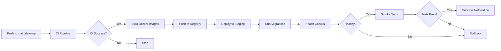
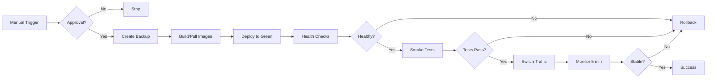

# BIOwerk Deployment Guide

## Table of Contents

1. [Overview](#overview)
2. [Prerequisites](#prerequisites)
3. [Deployment Environments](#deployment-environments)
4. [Deployment Workflows](#deployment-workflows)
5. [Deployment Process](#deployment-process)
6. [Rollback Procedures](#rollback-procedures)
7. [Health Checks](#health-checks)
8. [Troubleshooting](#troubleshooting)
9. [Emergency Procedures](#emergency-procedures)
10. [Post-Deployment Checklist](#post-deployment-checklist)

---

## Overview

BIOwerk uses an automated Continuous Deployment (CD) pipeline to ensure safe, reliable, and zero-downtime deployments to both staging and production environments.

### Key Features

- **Automated Staging Deployments**: Automatic deployment to staging on merge to main/develop
- **Manual Production Approvals**: Production deployments require manual approval
- **Blue-Green Deployment**: Zero-downtime production deployments
- **Automated Rollback**: Automatic rollback on deployment failures
- **Health Checks**: Comprehensive health verification before traffic switching
- **Notifications**: Slack/email notifications for deployment events
- **Audit Trail**: Complete deployment history and logging

### Deployment Strategy

- **Staging**: Automatic deployment on successful CI completion
- **Production**: Manual approval required, blue-green deployment strategy
- **Rollback Time**: < 5 minutes to previous version

---

## Prerequisites

### Required Tools

- `docker` - Container runtime
- `kubectl` - Kubernetes CLI (if using k8s)
- `aws` - AWS CLI (if using AWS)
- `curl` - HTTP client
- `jq` - JSON processor

### Required Access

- Container registry access (GitHub Container Registry)
- Kubernetes cluster access (staging and production)
- AWS/Cloud provider credentials (for S3, secrets, etc.)
- Deployment approval permissions (for production)

### Required Secrets

Configure these secrets in your CI/CD platform (GitHub Secrets):

**Staging:**
- `STAGING_POSTGRES_PASSWORD`
- `STAGING_MONGO_PASSWORD`
- `STAGING_REDIS_PASSWORD`
- `STAGING_JWT_SECRET`
- `STAGING_ENCRYPTION_KEY`
- `STAGING_GRAFANA_PASSWORD`
- `STAGING_AWS_ACCESS_KEY`
- `STAGING_AWS_SECRET_KEY`

**Production:**
- `PROD_POSTGRES_PASSWORD`
- `PROD_MONGO_PASSWORD`
- `PROD_REDIS_PASSWORD`
- `PROD_JWT_SECRET`
- `PROD_ENCRYPTION_KEY`
- `PROD_GRAFANA_PASSWORD`
- `PROD_AWS_ACCESS_KEY`
- `PROD_AWS_SECRET_KEY`
- `PROD_PAGERDUTY_KEY`

**Notifications:**
- `SLACK_WEBHOOK_URL` - Slack webhook for deployment notifications

---

## Deployment Environments

### Staging

**Purpose**: Pre-production testing and validation

**URL**: `https://staging.biowerk.example.com`

**Characteristics**:
- Automatic deployments on merge to main/develop
- Mirrors production configuration
- Uses staging databases (separate instances)
- Verbose logging enabled
- Shorter data retention (7 days)
- Test data only

**Use Cases**:
- Integration testing
- User acceptance testing (UAT)
- Performance testing
- Security testing
- Feature previews

### Production

**Purpose**: Live customer-facing environment

**URL**: `https://biowerk.example.com`

**Characteristics**:
- Manual approval required
- Blue-green deployment strategy
- Production-grade infrastructure
- Enhanced monitoring and alerting
- Long data retention (7 years for compliance)
- Real customer data

**SLAs**:
- **Uptime**: 99.9% (43 minutes downtime/month)
- **RTO**: 1 hour (Recovery Time Objective)
- **RPO**: 15 minutes (Recovery Point Objective)

---

## Deployment Workflows

### Automatic Staging Deployment



**Trigger**: Automatic on CI success for main/develop branches

**Duration**: ~10-15 minutes

**Steps**:
1. CI pipeline completes successfully
2. Docker images built with git SHA tags
3. Images pushed to container registry
4. Deployment workflow triggered
5. Database migrations executed
6. Services deployed with rolling updates
7. Health checks performed
8. Smoke tests executed
9. Notifications sent

### Manual Production Deployment



**Trigger**: Manual via GitHub Actions UI or after staging success

**Duration**: ~20-30 minutes

**Steps**:
1. Manual deployment triggered
2. **Approval gate** - requires manual confirmation
3. Pre-deployment backup created
4. Images deployed to "green" environment
5. Green environment health checks
6. Smoke tests on green environment
7. **Second approval** - confirm traffic switch
8. Traffic switched from blue to green
9. 5-minute monitoring period
10. Blue environment kept for quick rollback
11. Notifications sent

---

## Deployment Process

### 1. Staging Deployment

#### Automatic (on merge)

When you merge to `main` or `develop`:

1. CI pipeline runs automatically
2. On CI success, deployment workflow triggers
3. Staging deployment happens automatically
4. Monitor progress in GitHub Actions

#### Manual Staging Deployment

```bash
# Trigger manual staging deployment
gh workflow run deploy.yml \
  -f environment=staging \
  -f skip_tests=false
```

#### Using Deployment Scripts

```bash
# Deploy to staging with specific tag
./scripts/deploy_staging.sh \
  --registry ghcr.io \
  --prefix e-tech-playtech/biowerk \
  --tag v1.2.3 \
  --env staging

# Dry run (see what would be deployed)
./scripts/deploy_staging.sh \
  --registry ghcr.io \
  --prefix e-tech-playtech/biowerk \
  --tag v1.2.3 \
  --dry-run
```

### 2. Production Deployment

#### Prerequisites Checklist

Before deploying to production:

- [ ] Staging deployment successful
- [ ] All tests passing (unit, integration, E2E)
- [ ] Security scans passed
- [ ] No active production incidents
- [ ] Change request approved (if required)
- [ ] Deployment window scheduled
- [ ] On-call engineer available
- [ ] Rollback plan reviewed

#### Manual Production Deployment

**Option 1: GitHub Actions UI**

1. Go to Actions tab in GitHub
2. Select "CD Pipeline - Automated Deployment"
3. Click "Run workflow"
4. Select:
   - Branch: `main`
   - Environment: `production`
   - Skip tests: `false` (recommended)
5. Click "Run workflow"
6. **Approve deployment** when prompted

**Option 2: GitHub CLI**

```bash
# Trigger production deployment
gh workflow run deploy.yml \
  -f environment=production \
  -f skip_tests=false
```

**Option 3: Deployment Script**

```bash
# Production deployment (requires approval)
./scripts/deploy_production.sh \
  --registry ghcr.io \
  --prefix e-tech-playtech/biowerk \
  --tag v1.2.3 \
  --env production \
  --strategy blue-green

# With auto-approval (CI/CD only)
./scripts/deploy_production.sh \
  --registry ghcr.io \
  --prefix e-tech-playtech/biowerk \
  --tag v1.2.3 \
  --auto-approve
```

#### Deployment Monitoring

During deployment, monitor:

1. **GitHub Actions**: Real-time deployment logs
2. **Grafana**: `https://grafana.biowerk.com/d/production`
3. **Kubernetes**: `kubectl get pods -n biowerk-production -w`
4. **Logs**: `kubectl logs -f -n biowerk-production deployment/mesh`
5. **Slack**: Deployment notifications channel

#### Post-Deployment Verification

After deployment completes:

```bash
# Run health checks
./scripts/health_check.sh production --verbose

# Check all services
curl https://biowerk.example.com/health

# Monitor logs for 5 minutes
kubectl logs -f -n biowerk-production deployment/mesh --tail=100

# Check error rates in Grafana
open https://grafana.biowerk.com/d/production
```

---

## Rollback Procedures

### When to Rollback

Rollback immediately if you observe:

- ❌ Health checks failing
- ❌ Error rate spike (>1% increase)
- ❌ Latency degradation (>50% increase)
- ❌ Database migration failures
- ❌ Critical functionality broken
- ❌ Security vulnerabilities discovered

### Automatic Rollback

The deployment system automatically rolls back if:

- Health checks fail after deployment
- Smoke tests fail
- Services fail to start within timeout
- Critical errors detected during monitoring period

### Manual Rollback

#### Quick Rollback (to previous version)

```bash
# Staging rollback
./scripts/rollback.sh staging

# Production rollback (requires approval)
./scripts/rollback.sh production

# Emergency production rollback (skips approval)
./scripts/rollback.sh production --emergency
```

#### Rollback to Specific Version

```bash
# Rollback to specific tag
./scripts/rollback.sh production --to-tag v1.2.2

# Rollback specific service only
./scripts/rollback.sh production --service mesh --to-tag v1.2.2
```

#### Rollback Process

1. **Identify issue**: Determine if rollback is necessary
2. **Execute rollback**: Run rollback script
3. **Verify health**: Confirm services are healthy
4. **Monitor**: Watch metrics for 15 minutes
5. **Communicate**: Notify team and stakeholders
6. **Post-mortem**: Document what happened and why

#### Rollback Time Expectations

| Environment | Target Rollback Time | Maximum Rollback Time |
|-------------|---------------------|----------------------|
| Staging     | 2 minutes          | 5 minutes            |
| Production  | 3 minutes          | 5 minutes            |

### Post-Rollback Actions

After successful rollback:

1. ✅ Verify all services healthy
2. ✅ Check error rates normalized
3. ✅ Create incident report
4. ✅ Investigate root cause
5. ✅ Fix issues in new deployment
6. ✅ Test fix in staging
7. ✅ Schedule new production deployment

---

## Health Checks

### Running Health Checks

```bash
# Check staging
./scripts/health_check.sh staging

# Check production with verbose output
./scripts/health_check.sh production --verbose

# Check specific service
./scripts/health_check.sh production --service mesh

# Custom timeout
./scripts/health_check.sh production --timeout 600
```

### Health Check Components

The health check script verifies:

1. **HTTP Health Endpoint**: `/health` endpoint returns 200
2. **Kubernetes Status**: Pods running and ready
3. **Database Connectivity**: Can connect to PostgreSQL/MongoDB
4. **Service Dependencies**: Inter-service communication working
5. **Resource Usage**: CPU/memory within limits

### Health Endpoints

| Endpoint | Purpose | Expected Response |
|----------|---------|-------------------|
| `/health` | Liveness probe | `{"status": "healthy"}` |
| `/ready` | Readiness probe | `{"status": "ready"}` |
| `/metrics` | Prometheus metrics | Prometheus format |

### Interpreting Health Check Results

**All Healthy**: ✅ All services operational
```
✓ mesh is healthy (4/4 checks passed)
✓ osteon is healthy (4/4 checks passed)
```

**Degraded**: ⚠️ Service operational but with warnings
```
⚠ mesh is degraded (3/4 checks passed)
  Database connectivity check failed
```

**Unhealthy**: ❌ Service not operational
```
✗ mesh is unhealthy (1/4 checks failed)
  HTTP health check failed
  Kubernetes deployment unhealthy
```

---

## Troubleshooting

### Common Issues

#### 1. Deployment Stuck

**Symptom**: Deployment not progressing

**Diagnosis**:
```bash
# Check pod status
kubectl get pods -n biowerk-production

# Check pod events
kubectl describe pod <pod-name> -n biowerk-production

# Check recent events
kubectl get events -n biowerk-production --sort-by='.lastTimestamp'
```

**Solutions**:
- Check image pull errors
- Verify resource limits
- Check for pending PVCs
- Review network policies

#### 2. Health Checks Failing

**Symptom**: Health checks timing out or failing

**Diagnosis**:
```bash
# Test health endpoint directly
curl -v https://biowerk.example.com/health

# Check service logs
kubectl logs -n biowerk-production deployment/mesh --tail=100

# Check for CrashLoopBackOff
kubectl get pods -n biowerk-production | grep -i crash
```

**Solutions**:
- Check database connectivity
- Verify environment variables
- Check resource exhaustion
- Review application logs

#### 3. Database Migration Failures

**Symptom**: Migrations fail during deployment

**Diagnosis**:
```bash
# Check migration logs
kubectl logs -n biowerk-production job/migrations

# Connect to database
kubectl exec -it postgres-0 -n biowerk-production -- psql -U biowerk
```

**Solutions**:
- Roll back migration
- Fix migration script
- Check database locks
- Verify database permissions

#### 4. Traffic Not Switching

**Symptom**: Traffic still routing to old version

**Diagnosis**:
```bash
# Check service selector
kubectl get service mesh -n biowerk-production -o yaml

# Check endpoints
kubectl get endpoints mesh -n biowerk-production

# Check ingress
kubectl get ingress -n biowerk-production
```

**Solutions**:
- Verify service selectors
- Check ingress configuration
- Validate load balancer settings
- Review DNS records

### Debug Commands

```bash
# Get all resources in namespace
kubectl get all -n biowerk-production

# Describe deployment
kubectl describe deployment mesh -n biowerk-production

# Get recent logs
kubectl logs -n biowerk-production deployment/mesh --tail=100 --timestamps

# Follow logs
kubectl logs -f -n biowerk-production deployment/mesh

# Execute command in pod
kubectl exec -it mesh-xxxxx -n biowerk-production -- /bin/bash

# Check resource usage
kubectl top pods -n biowerk-production

# Check for pending pods
kubectl get pods -n biowerk-production --field-selector=status.phase=Pending
```

---

## Emergency Procedures

### Incident Response

#### 1. Detect

**Monitoring Alerts**: PagerDuty, Grafana, Slack

**Manual Detection**: User reports, monitoring dashboards

#### 2. Assess

```bash
# Quick health check
./scripts/health_check.sh production

# Check error rates
curl https://prometheus.biowerk.com/api/v1/query?query=rate(http_requests_total{status=~"5.."}[5m])

# Check recent deployments
kubectl rollout history deployment/mesh -n biowerk-production
```

#### 3. Respond

**If deployment-related**:
```bash
# Immediate rollback
./scripts/rollback.sh production --emergency
```

**If infrastructure issue**:
- Scale up resources
- Check external dependencies
- Review recent changes

#### 4. Communicate

- Update status page
- Notify stakeholders
- Send Slack updates
- Create incident channel

#### 5. Resolve

- Fix root cause
- Verify resolution
- Monitor for stability
- Document in post-mortem

### Emergency Contacts

| Role | Contact | When to Escalate |
|------|---------|------------------|
| On-Call Engineer | PagerDuty | Any production issue |
| Platform Lead | Slack @platform-lead | Infrastructure issues |
| Security Team | Slack @security | Security incidents |
| CTO | Phone (emergency) | Critical outage >1 hour |

### Rollback Decision Matrix

| Severity | Criteria | Action | Approval |
|----------|----------|--------|----------|
| P0 - Critical | Complete outage | Immediate rollback | Not required |
| P1 - High | >5% error rate | Rollback within 5 min | On-call approval |
| P2 - Medium | >1% error rate | Investigate first | Team approval |
| P3 - Low | Minor issues | Monitor and plan fix | Not required |

---

## Post-Deployment Checklist

### Immediately After Deployment (0-15 minutes)

- [ ] All health checks passing
- [ ] Error rate < 0.1%
- [ ] Latency within SLA (p95 < 500ms)
- [ ] No increase in 5xx errors
- [ ] Database queries performing normally
- [ ] Background jobs running
- [ ] Monitoring/alerting functional

### Short-term Monitoring (15-60 minutes)

- [ ] User-reported issues: None
- [ ] Resource utilization: Normal
- [ ] Cache hit rates: Stable
- [ ] Database connection pools: Healthy
- [ ] Service mesh: No failures
- [ ] Logs: No anomalies

### Long-term Monitoring (1-24 hours)

- [ ] Daily active users: Normal
- [ ] Business metrics: On track
- [ ] Memory leaks: None detected
- [ ] Background job queues: Processing normally
- [ ] Audit logs: Recording properly

### Documentation

- [ ] Deployment recorded in tracking system
- [ ] Release notes updated
- [ ] Changelog updated
- [ ] Known issues documented
- [ ] Runbook updated (if needed)

### Communication

- [ ] Team notified of successful deployment
- [ ] Stakeholders informed
- [ ] Status page updated
- [ ] Deployment summary shared

---

## Deployment Metrics

Track these metrics for each deployment:

| Metric | Target | Critical Threshold |
|--------|--------|-------------------|
| Deployment Duration | < 15 minutes | > 30 minutes |
| Rollback Time | < 5 minutes | > 10 minutes |
| Success Rate | > 95% | < 80% |
| Error Rate Increase | < 0.1% | > 1% |
| Latency Increase | < 10% | > 50% |

---

## Best Practices

### Before Deployment

1. ✅ Review all changes being deployed
2. ✅ Ensure staging deployment successful
3. ✅ Run full test suite
4. ✅ Check for database migration risks
5. ✅ Verify rollback plan
6. ✅ Schedule during low-traffic window
7. ✅ Notify team of upcoming deployment
8. ✅ Have on-call engineer available

### During Deployment

1. ✅ Monitor deployment progress actively
2. ✅ Watch error rates and latency
3. ✅ Be ready to rollback immediately
4. ✅ Communicate status updates
5. ✅ Document any issues observed

### After Deployment

1. ✅ Monitor for 24 hours
2. ✅ Verify all features working
3. ✅ Check business metrics
4. ✅ Update documentation
5. ✅ Conduct post-deployment review

---

## Additional Resources

- [CI/CD Pipeline Documentation](./.github/workflows/)
- [Disaster Recovery Guide](./DISASTER_RECOVERY.md)
- [Monitoring and Alerting](./MONITORING_AND_ALERTING.md)
- [Security Guidelines](./SECURITY.md)
- [Backup Procedures](./BACKUP_QUICKSTART.md)

---

## Support

For deployment assistance:

- **Slack**: `#biowerk-deployments`
- **Email**: `ops-team@biowerk.com`
- **PagerDuty**: For emergency escalation
- **Documentation**: This guide

---

**Last Updated**: 2025-11-17

**Version**: 1.0.0
